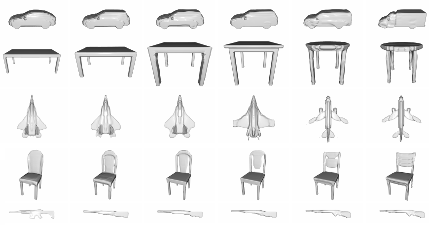

# HyperCube: Implicit Field Representations of Voxelized 3D Models 

Authors: Magdalena Proszewska, Marcin Mazur, Tomasz Trzcinski, Przemysław Spurek

[[Paper]](http://arxiv.org/abs/2110.05770)

#### Abstract
Recently introduced implicit field representations offer an effective way of generating 3D object shapes. They leverage implicit decoder trained to take a 3D point coordinate concatenated with a shape encoding and to output a value which indicates whether the point is outside the shape or not. Although this approach enables efficient rendering of visually plausible objects, it has two significant limitations. First, it is based on a single neural network dedicated for all objects from a training set which results in a cumbersome training procedure and its application in real life. More importantly, the implicit decoder takes only points sampled within voxels (and not the entire voxels) which yields problems at the classification boundaries and results in empty spaces within the rendered mesh.

Code is based on [3d-point-clouds-HyperCloud](https://github.com/gmum/3d-point-clouds-HyperCloud), [IM-NET-pytorch](https://github.com/czq142857/IM-NET-pytorch) and [IM-NET](https://github.com/czq142857/IM-NET).




## Requirements
- dependencies stored in `requirements.txt`.
- Python 3.6+
- cuda

## Installation
If you are using `Conda`:
- run `bash install_requirements.sh` 

otherwise:
- install `cudatoolkit` and run `pip install -r requirements.txt`

## Usage
**Add project root directory to PYTHONPATH**

```export PYTHONPATH=project_path:$PYTHONPATH```

## Voxels dataset

Download dataset from [here](https://drive.google.com/file/d/1ykE6MB2iW1Dk5t4wRx85MgpggeoyAqu3/view) and set the dataset location in the hyperparams files in the **data_dir** key.
 
 Classes can be specified in the hyperparams files in the **classes** key and the **test_classes** key
```
airplane, car, chair, rifle, table
```


## Training

### HyperCube
`python experiments/train.py --config settings/hyperparams.json`

### HyperCube-Interval
`python experiments/train.py --config settings/hyperparams_interval.json`

### Latent GAN
`python latent_GAN/train.py --input latents.pt --output outdir -c airplane`

`input` is a tensor with latent vectors for class airplane obtained from a trained hypernetwork. `c` is one of `[airplane, car, chair, rifle, table]`.


